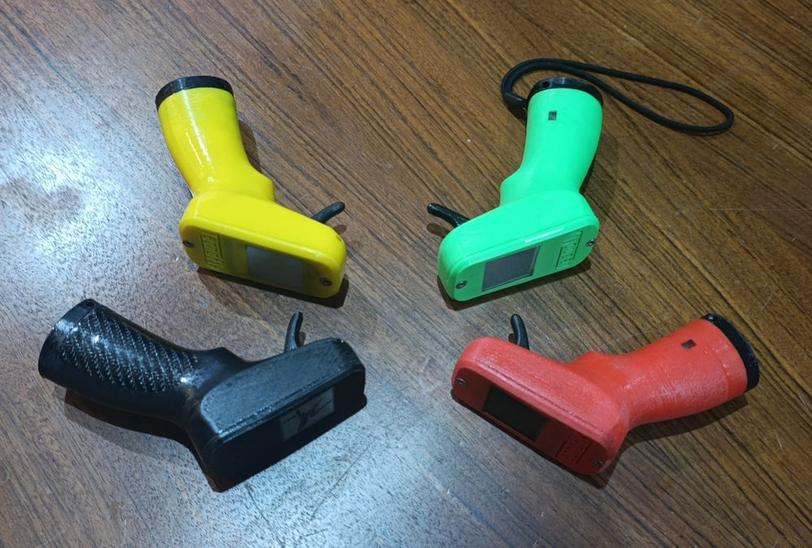
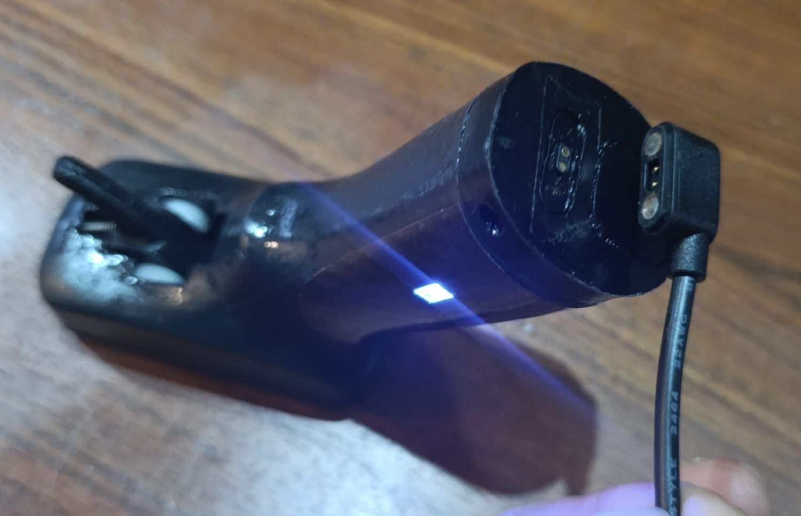
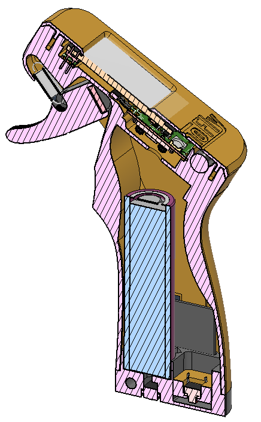
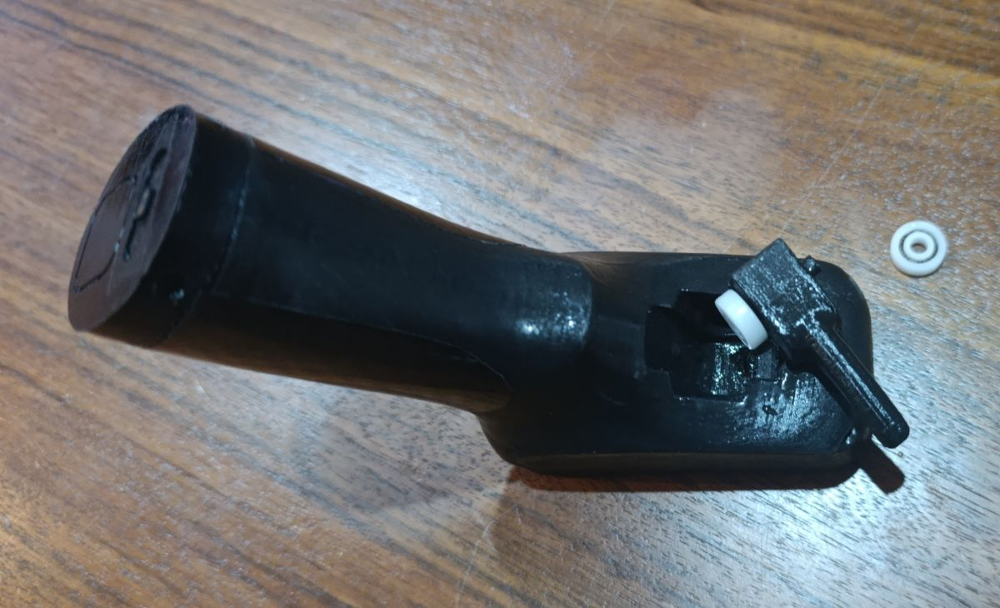
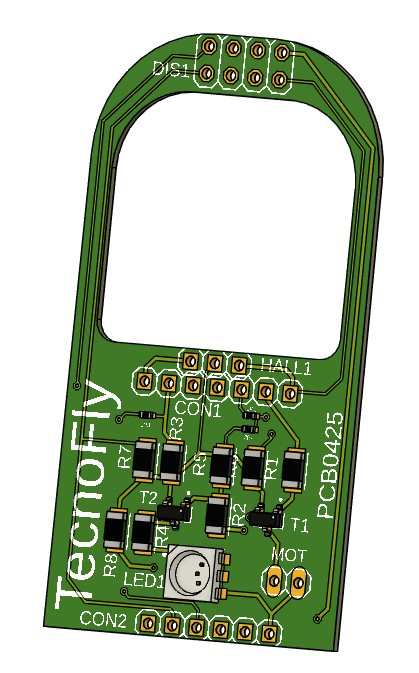
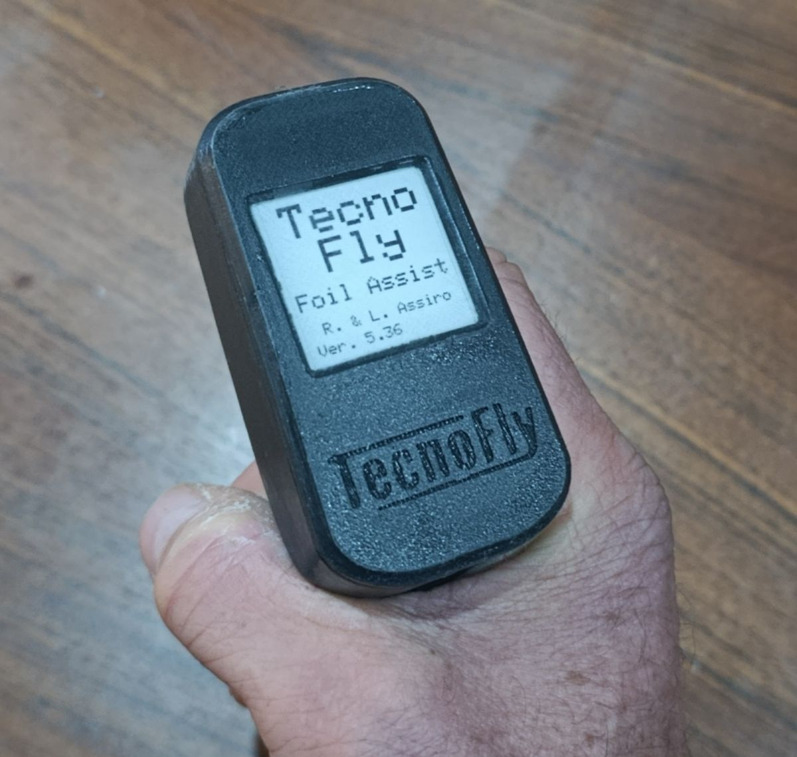
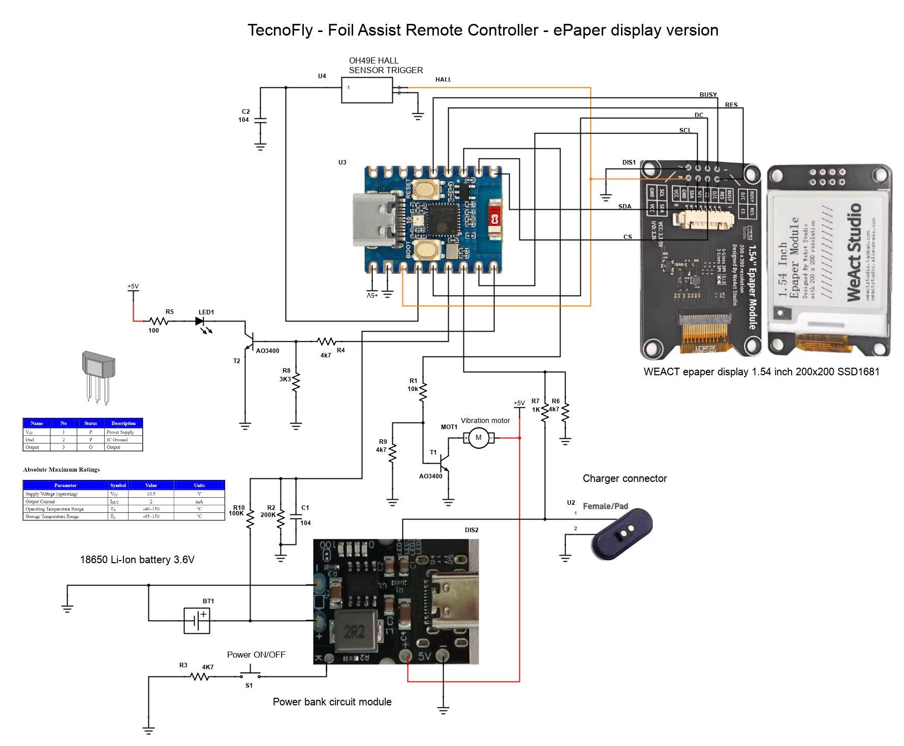
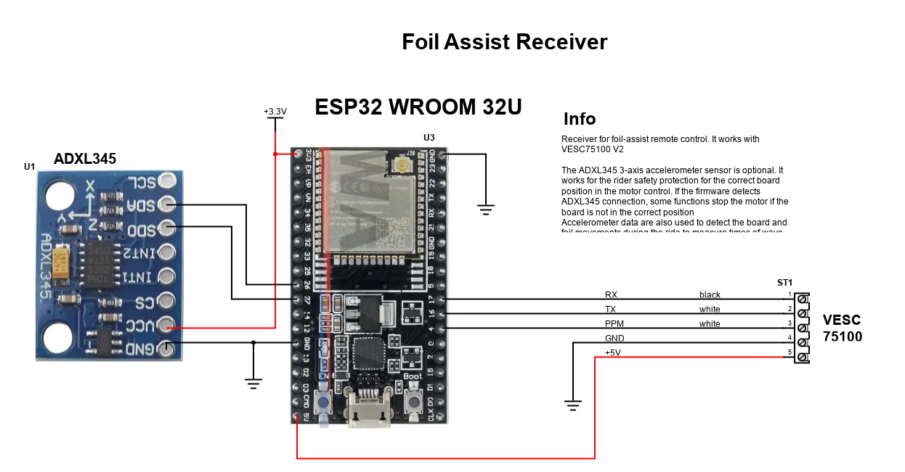

# TecnoFly — Foil Assist Remote Controller

**A wireless remote control system for electric hydrofoil assist, built around ESP32 and ESP-NOW.**

> Main project website: [www.foilassistproject.com](http://www.foilassistproject.com)

---


*3D-printed controller housings in multiple colors*

---

## Overview

This project provides a complete wireless remote control system designed specifically for electric hydrofoil (e-foil) motor assist. While it was born for hydrofoil use, it can also be used with electric skateboards, tow boggies, and other ESC-driven devices.

The system consists of two main components:

- **Transmitter** — a handheld pistol-grip controller with a Hall-effect throttle sensor and a 1.54" ePaper display
- **Receiver** — an ESP32 module mounted inside the board, connected to a VESC 75100 motor controller

Communication uses the **ESP-NOW** protocol, a peer-to-peer Wi-Fi protocol that allows direct, low-latency data exchange between ESP32 devices using their MAC addresses — no router or network infrastructure required.

---

## Hardware

### Transmitter


*Transmitter with magnetic charging connector and status LED*


*Internal cross-section: battery, PCB, ePaper display, and trigger mechanism*


*Hall-effect throttle trigger assembly*

**Key components:**
- ESP32-C3 Zero microcontroller
- OH49E Hall-effect sensor (throttle)
- WeAct 1.54" ePaper display (200×200, SSD1681)
- 18650 Li-Ion battery (3.6V)
- Power bank circuit module (5V boost)
- Vibration motor (haptic feedback)
- Magnetic charging connector (pogo pins)
- AO3400 N-channel MOSFETs
- Custom PCB (TecnoFly PCB0425)
- STL 3D print parts: https://www.thingiverse.com/thing:6746363


*Custom PCB — TecnoFly PCB0425*


*1.54" ePaper display showing startup screen with firmware version*

#### Transmitter Schematic


*Full schematic — TecnoFly Foil Assist Remote Controller (ePaper display version)*

---

### Receiver


*Receiver schematic — ESP32 WROOM 32U connected to VESC 75100*

**Key components:**
- ESP32 WROOM 32U module
- ADXL345 3-axis accelerometer *(optional but recommended)*
- VESC 75100 motor controller interface (UART + PPM)

The ADXL345 accelerometer is optional but provides important safety and analytics features:
- Stops the motor if the board is not in the correct riding position
- Detects board and foil movements to measure wave timing and pump cadence

---

## Radio Transmission

2.4 GHz radio is highly sensitive to water — it can be completely blocked when the remote is submerged. To address this, a **passive antenna is installed inside the board**, extending the effective range even when the rider's hand dips into the water.

---

## Data Logging & Analytics

A key design goal was full data ownership and ride analytics. The receiver logs the following data **every second** for each ride session:

- Battery voltage and state of charge
- Power consumption (W)
- Throttle level
- Motor power output
- Board physical position (from ADXL345)
- Board acceleration

Each ride generates a separate data file stored on the receiver. A **Wi-Fi hotspot** is created by the receiver, allowing the rider to connect via any browser and view graphical charts of the last 10 rides — no app required.

The firmware also provides real-time feedback on the remote display, including performance metrics for wave riding and pump foiling sessions.

---

## Firmware Features

- Wireless throttle control via ESP-NOW
- Real-time ePaper display (battery level, speed, motor power, ride mode)
- Vibration motor feedback
- Ride data logging to flash memory
- Wi-Fi web interface for ride data visualization
- Safety cutoff based on board orientation (when ADXL345 is connected)
- Multiple riding modes

---

## Repository Structure

```
foil-assist-controller/
├── transmitter/       # ESP32-C3 Zero firmware (handheld remote)
├── receiver/          # ESP32 WROOM 32U firmware (board-mounted)
├── images/            # Photos and schematics
└── README.md
```

---

## Getting Started

1. **Hardware:** Assemble the transmitter and receiver circuits according to the schematics above.
2. **Pair devices:** Flash both firmwares and update the MAC address of the receiver in the transmitter firmware.
3. **VESC configuration:** Connect the receiver to the VESC 75100 via UART (RX/TX) and PPM.
4. **Power on:** The transmitter display will show the startup screen and firmware version on boot.
5. **Ride data:** After a session, connect to the receiver's Wi-Fi hotspot and open a browser to view ride analytics.

---

## Credits

Designed and developed by **R. & L. Assiro** — TecnoFly  
Firmware version: 5.36

---

## License

This project is open source. See [LICENSE](LICENSE) for details.
